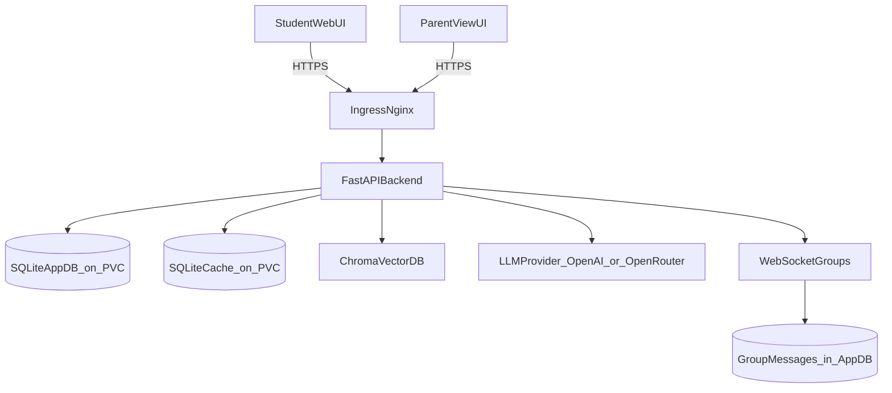

## Backup slides (use only if judges ask)

### Backup Slide A — Architecture (simple, judge-friendly)

Talking points (10–20s):
- Single-instance deployment is intentional for a school pilot.
- Persistent storage on PVC keeps student progress, notes, and quizzes durable.
- LLM provider is swappable (OpenAI/OpenRouter/Ollama modes supported).

---

### Backup Slide B — Security & privacy model (layered)

**Identity model**
- Students use **masked pseudonyms** (no real names required for the demo).
- Students authenticate via **PIN** (hashed + salted in DB).
- Parents authenticate via **Parent PIN** for parent actions.

**Transport + session**
- Session token sent via `X-Mentorbot-Session` header (avoids conflicts with Basic Auth).
- Sessions have TTL and are stored server-side.

**Portal protection (recommended)**
- Protect parent/admin paths at the ingress layer (Basic Auth) + Parent PIN in-app.
- Keep student landing page public to avoid repeated browser prompts.

**Data minimization**
- Per-student progress and notes are private.
- Comparison stats are anonymous and aggregate-only.

---

### Backup Slide C — Planned impact metrics (what we can measure)

**Mastery and learning**
- Concept completion rate (passed vs pending vs skipped)
- Quiz pass rate over time (first-try vs retries)
- Average time-to-mastery per concept
- Difficulty progression vs performance

**Engagement**
- Sessions per week, questions asked, notes created
- Optional: group participation (messages, joins)

**Parent visibility**
- Report views generated per week
- Parent actions: roster imports, PIN resets

**Safety / scope**
- Off-topic refusal count (requests outside allowed school subjects)
- Manual review sampling from daily chat logs (if enabled)

How we’ll use metrics in a pilot:
- Baseline for 1 week → intervention for 2–4 weeks → compare mastery trends.

